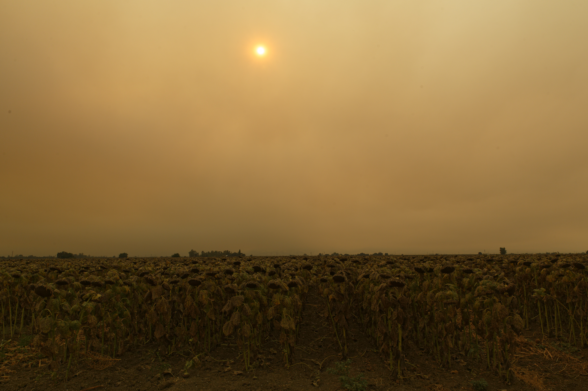
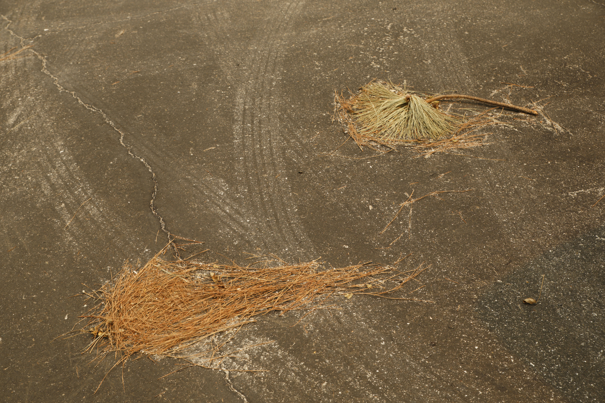
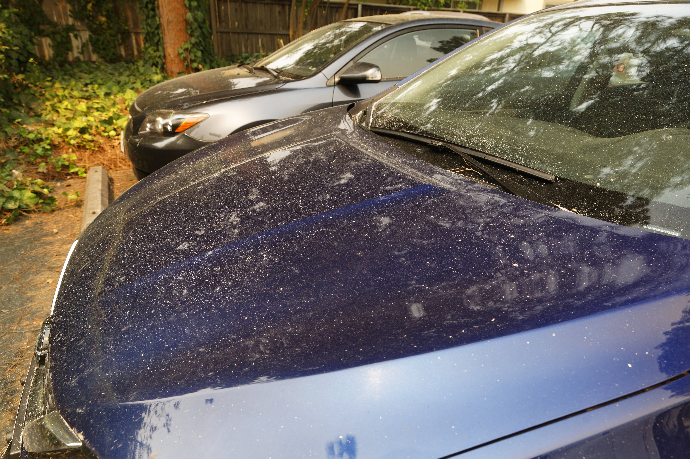
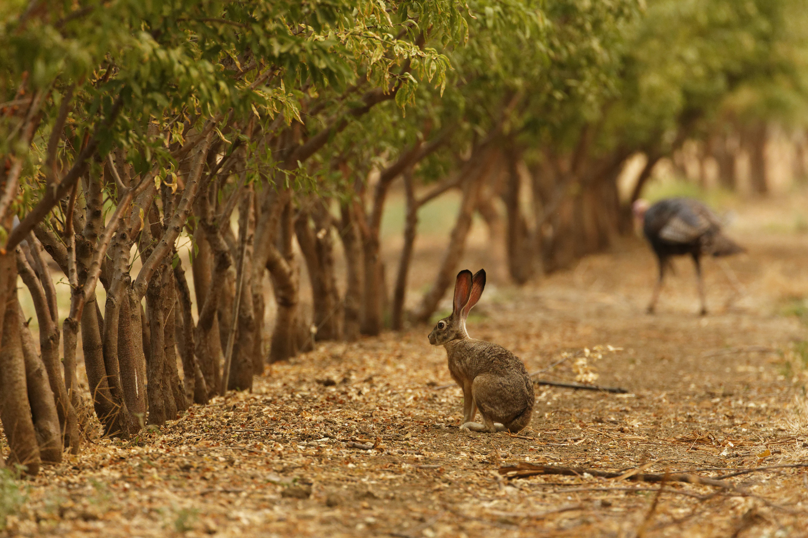
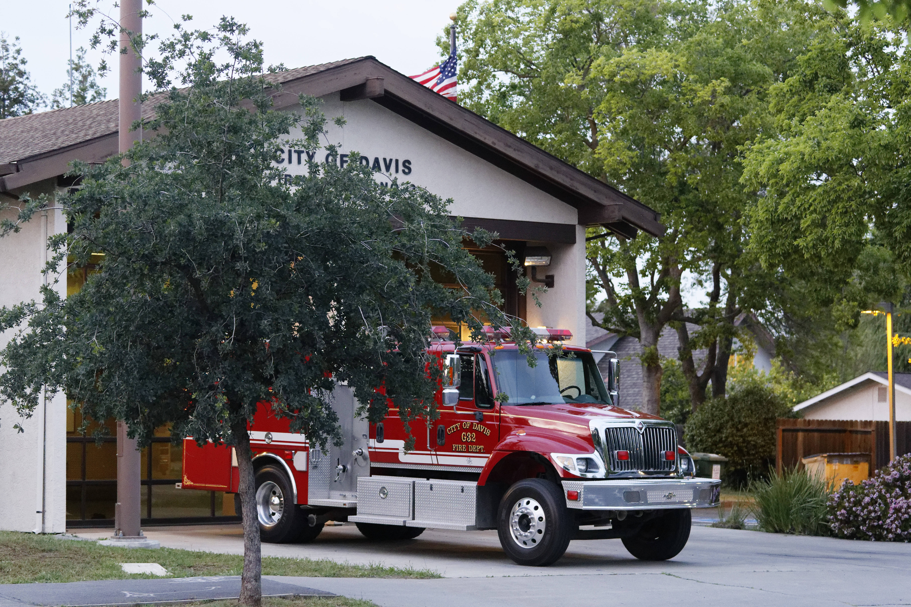

*Auteur: Frédéric Silvestre*

Il était écrit que notre séjour de 6 mois en Californie n'allait pas être de tout repos. Après avoir fait l'expérience de la pandémie du Covid19 loin de chez nous, voilà qu'une autre menace s'abattait sur cet Etat, tout comme d'ailleurs sur l'ensemble de la côte Ouest. Ce danger était pourtant moins exceptionnel que l'apparition d'un nouveau virus, puisque c'est un phénomène naturel qui revient chaque année: les feux de forêt (ou wildfires en anglais). Cette année 2020 a néanmoins été exceptionnelle puisqu'elle est devenue l'année record en terme de superficie brûlée. Au total, ce sont plus ou moins 18 000 km2 (soit 4% de la superficie totale de la Californie) de forêts et buissons qui sont partis en fumée rien qu'en Californie (alors que les feux se sont étendus au nord jusqu'aux abords de Seattle). Le plus grand feu de tous portait le nom d' "August complex" car il était issu de la fusion de 38 feux distincts en un seul et énorme complexe. Il avait commencé le 16 août pour être enfin contenu le...12 novembre, soit 12 semaines plus tard.  
&nbsp;

:-:
<b>Un champ de tournesol sous un ciel orange pendant les incendies de 2020 à Davis</b>

Notre expérience personnelle de ce feu restera dans nos mémoires. Pendant plusieurs jours et semaines, la population a vécu au rythme des indicateurs de qualité de l'air, accessibles en un click sur le site web officiel www.airnow.gov. Celle-ci était hélas souvent dans sa valeur extrême, ce qui rendait très difficile tout incursion hors de son logement. Impossible de vivre sans air conditionné dans ces conditions, avec plus de 40°C en permanence et aucune solution pour respirer un peu d'air frais. Au fur et à mesure que le feu grandissait et se rapprochait, le ciel virait à l'orange, d'abord légèrement, comme un beau coucher de soleil, mais ensuite de plus en plus foncé. Toute la lumière devenait chaude et le soleil n'était plus qu'une silhouette orangée que l'on devinait à travers l'énorme nuage de fumée et de cendres. L'impression d'entrer en enfer avait alors pris le pas. Celle-ci était encore renforcée par la chute de cendres venues du ciel. Ces cendres recouvraient petit à petit les terrasses, les routes et les voitures, laissant derrière elles une odeur de barbecue mal éteint. Nous ne pouvons pas dire qu'on a eu peur. Nous ne pouvons pas dire que l'on était rassurés non plus. Le feu progressait en effet très vite et choisissait sa direction en fonction du vent dominant. En quelques minutes, si le vent se levait, le feu pouvait alors se rapprocher dangereusement des habitations. Une seule solution alors, partir très vite ! Cette année 2020 aura vu la mort de 31 personnes, mais c'est loin d'être le record. En 2018, le "Camp Fire" avait sévi dans le nord de l'Etat et avait surpris le village de Paradise au petit matin. 85 personnes y avaient péris, piégés par les flammes (un très bon documentaire est disponible sur Netflix https://www.youtube.com/watch?v=5KNAl23NwME). 
&nbsp;

 
:-:
<b>La silhouette du soleil à travers un nuage de fumée et de cendres</b>

A Davis, les pompiers étaient rassurants. La ville étant entourée de cultures peu inflammables, il y avait peu de risques d'y être piégé par les flammes. Néanmoins, nous avons quand même dû nous y préparer et boucler notre valise "au cas où". En effet, si la situation tournait mal, nous devions être prêts à évacuer dans les 5 minutes, au milieu de la nuit s'il le fallait. C'est ce qui est arrivé à la ville voisine de Vacaville, le centre régional du shopping, puisque le feu avait contraint des centaines de personnes à quitter leur habitation au milieu de la nuit. J'avoue que la première nuit, j'ai eu du mal à fermer l'oeil. J'ai bien pris soin de laisser la porte de la chambre ouverte afin d'être sûr d'entendre les pompiers s'ils venaient frapper à notre porte au milieu de la nuit. Bon, je pense qu'ils auraient fait suffisamment de bruit, mais on ne sait jamais, avec mon sommeil de plomb... Après une bonne semaine passée enfermés dans l'appartement, nous avons enfin pu sortir. Le feu s'étant arrêté à une quinzaine de miles de Davis. Mais l'air était toujours de très mauvaise qualité. Nous sommes alors allé à San Francisco pour un long week-end, là où le feu n'avait pas encore troublé la vie, et où il faisait quelques degrés de moins. Le long de la route, nous devions passer à côté de Vacaville, et il était impressionnant de voir les buissons et quelques maisons brûlés de part et d'autre. Même la berne centrale de l'autoroute n'était plus qu'une ligne continue de cendres.
&nbsp;

 
&nbsp;

:-:
<b>Des cendres recouvrant les routes et les voitures</b>

La plupart des feux démarrent suite à des éclairs, très nombreux en été. Cette année-là, il y en a eu presque 10 000 en Californie ! Heureusement, la plupart des feux restent discrets. Mais parfois, il échappe à tout contrôle et ravage des milliers d'hectares. C'est ce qui s'est également passé durant l'été austral 2019-20 en Australie. Tout le monde se souvient des images de koalas et autres kangourous brûlés. Au total, on estime à 3 milliards le nombre d'animaux tués ou déplacés par ce gigantesque incendie (il a ravagé 97 000 km2). Et on ne compte ici que les vertébrés puisqu'il est impossible de dénombrer les insectes, araignées et autres invertébrés impactés par les flammes. Les scientifiques estiment que ces feux australiens ont provoqué une augmentation de 14% du nombre d'espèces menacées d'extinction ce qui, en une seule saison, est immense. Gigantesque est aussi la quantité de CO2 dissipée dans l'atmosphère suite à la combustion de la végétation. Les feux en 2019-20 ont relargué 80 fois plus de CO2 que ce qui est observé pendant une saison normale. Et si il est généralement admis que le CO2 émis par les feux est recapturé quand la végétation grandit à nouveau, il est légitime de se demander si c'est aussi le cas des mégafeux. Ces feux gigantesques sont caractérisés par leur intensité, leur taille, leur durée et leur dimension incontrôlable. Et si les feux de forêt ont toujours existé, on assiste depuis quelques années à une augmentation de la fréquence de ces mégafeux, ce qui a conduit certains scientifiques a requalifier notre ère de pyrocène (par analogie avec l'anthropocène).
&nbsp;

:-:
<b>Des animaux nerveux durant les incendies</b>

Lorsqu'une catastrophe naturelle se produit, on cherche des responsables contre qui les compagnies d'assurance peuvent se retourner. Dans le cas des feux que nous avons vécu en Californie, nous avions été surpris de constater la bataille qui avait lieu entre le camp démocrate du gouverneur Newsom, et le camp républicain du président Trump. Pour le premier, la fréquence et l'intensité des mégafeux est le résultat du réchauffement climatique et seule une réduction drastique des émission de gaz à effet de serre pourra enrayer la répétition de ces drames. Pour le second, c'est la mauvaise gestion des forêts et du bush qui en est le principal responsable.  Du côté des scientifiques, les deux explications ne sont pas exclusives et il est probable qu'elles soient  toutes les deux impliquées. Toujours est-il qu'il est fort à parier que de tels événements se reproduiront encore et encore, avec des conséquences catastrophiques pour les hommes comme pour la biodiversité. D'ailleurs, l'été 2021 vient aussi de nous montrer un nouvel exemple d'embrasement de la planète, avec cette fois de nombreuses régions européennes également touchées. En Californie, si la surface totale brûlée a été moindre qu'en 2020, elle a cette fois touché les forêts de séquoias géants, ces magnifiques arbres millénaires vivant dans la Sierra Nevada. Des images montrant le Général Sherman, être vivant le plus gros (en biomasse) de la planète, protégé dans de l'aluminium ont fait le tour du monde. Tout au long de ses 2000 ans de vie, il en a vu d'autres et il a cette fois encore survécu à cette saison de feu. Espérons que ce n'est pas qu'un sursis.
&nbsp;

:-:
<b>Un camion de pompiers à Davis</b>
&nbsp;


:-:
<b>Vidéo prise de l'autoroute entre Davis et San Francisco, à hauteur de Vacaville, après le passage du feu</b>

*Bibliographie:*
- Nimmo *et al.* 2021. [Welcome to the Pyrocene: Animal survival in the age of megafire](https://onlinelibrary.wiley.com/doi/abs/10.1111/gcb.15834).
- Keeley and Syphard 2019. [Twenty-first century California, USA, wildfires: fuel-dominated vs. wind-dominated fires](https://fireecology.springeropen.com/articles/10.1186/s42408-019-0041-0)
- Crippa *et al.* 2020. [Fossil CO2 emissions of all world countries - 2020 Report](https://publications.jrc.ec.europa.eu/repository/handle/JRC121460)
- Dickman 2021. [Ecological consequences of Australia's "Black Summer" bushfires: Managing for recovery](https://setac.onlinelibrary.wiley.com/doi/10.1002/ieam.4496)
- Hamideh *et al.* 2021. [Wildfire impacts on education and healthcare: Paradise, California, after the Camp Fire](https://www.ncbi.nlm.nih.gov/pmc/articles/PMC8500817/)

